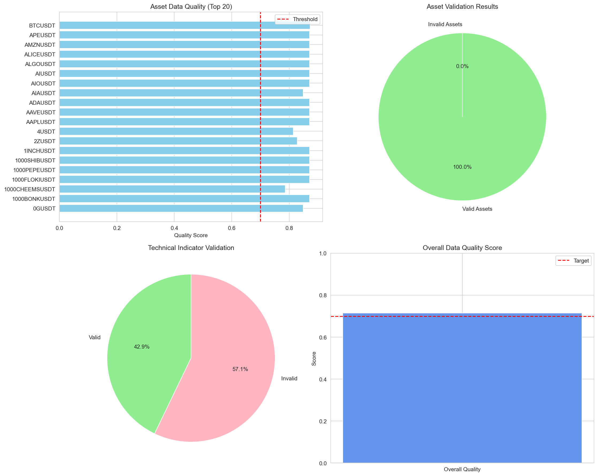
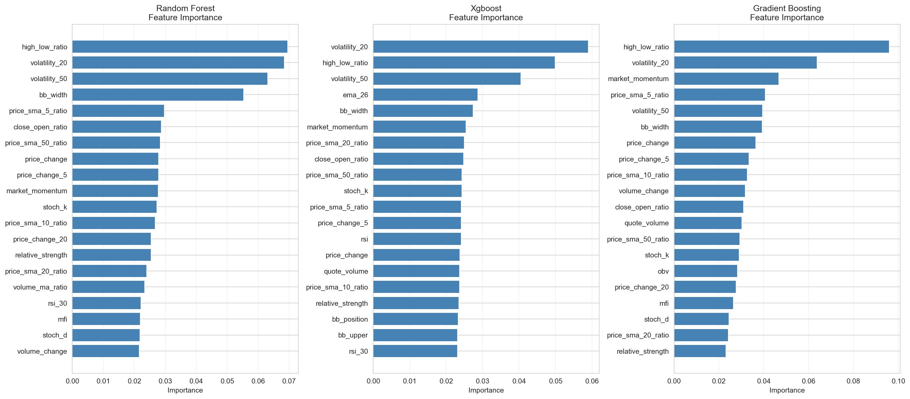
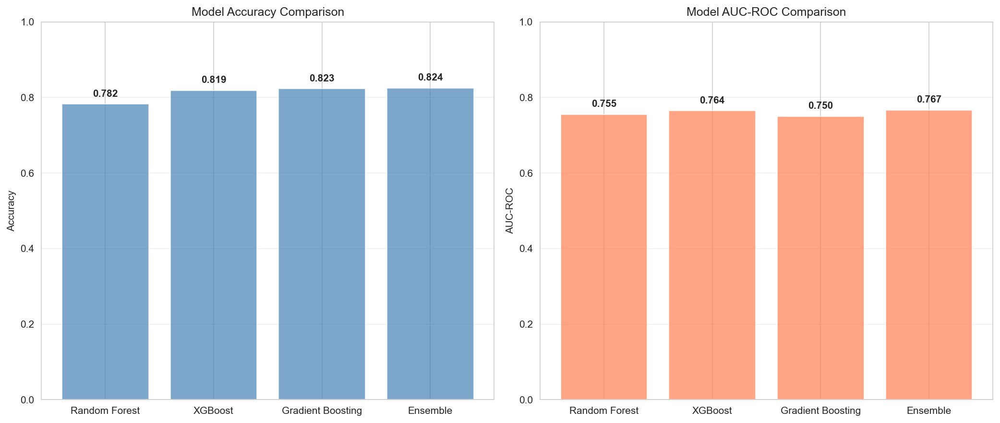

# 🚀 Comprehensive AI Trading Model - Training Report

**Generated**: 2025-10-15 18:40:55

---

## 📊 Executive Summary

- **Total Assets Trained**: 50
- **Total Features**: 41
- **Training Samples**: 6,903
- **Test Samples**: 1,726
- **Best Model**: Ensemble
- **Best Accuracy**: 82.44%
- **Overall Quality Score**: 71.43%

## ✅ Data Validation Results

### Aster DEX Assets
- Total assets scanned: 78
- Valid assets: 78
- Validation rate: 100.0%

## 🛠️ Feature Engineering

### Technical Indicators Created:

1. **Price-based**: price_change, high_low_ratio, close_open_ratio
2. **Moving Averages**: SMA (5, 10, 20, 50), EMA (12, 26)
3. **Momentum**: MACD, RSI (14, 30), Stochastic Oscillator
4. **Volatility**: Bollinger Bands, ATR, Rolling Std
5. **Volume**: OBV, MFI, Volume MA Ratio
6. **Cross-Asset**: Market momentum, Relative strength

## 🤖 Model Performance

### Random Forest

- **Accuracy**: 78.22%
- **AUC-ROC**: 0.755

### XGBoost

- **Accuracy**: 81.87%
- **AUC-ROC**: 0.764

### Gradient Boosting

- **Accuracy**: 82.27%
- **AUC-ROC**: 0.750

### Ensemble

- **Accuracy**: 82.44%
- **AUC-ROC**: 0.767

## 💡 Recommendations

✅ **EXCELLENT** - Model ready for paper trading

### Next Steps:

1. Deploy best model to paper trading
2. Monitor performance for 48-72 hours
3. Collect real trading feedback
4. Retrain weekly with new data
5. Scale to live trading when validated

---

*Report generated by Aster AI Trading System*
